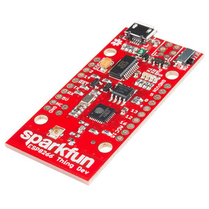
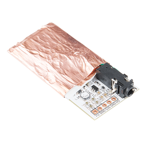
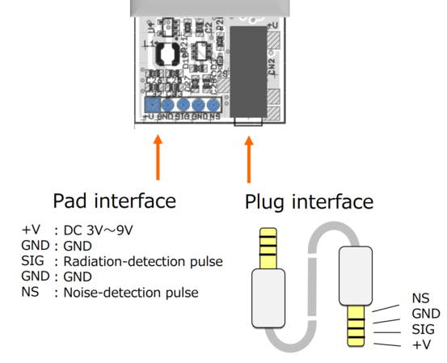
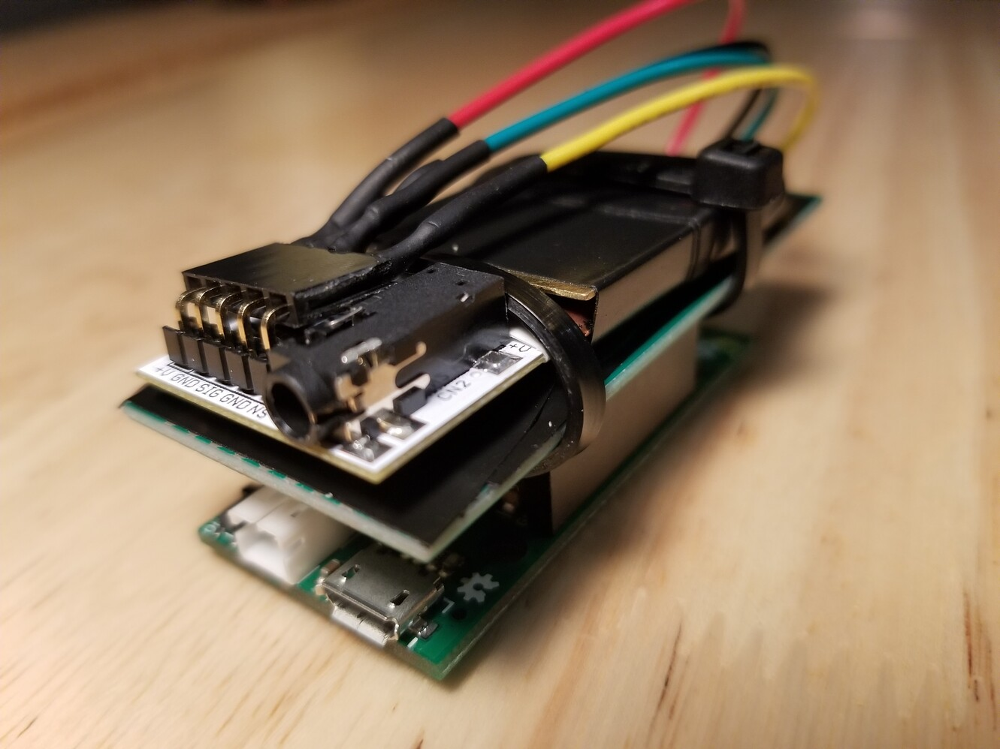
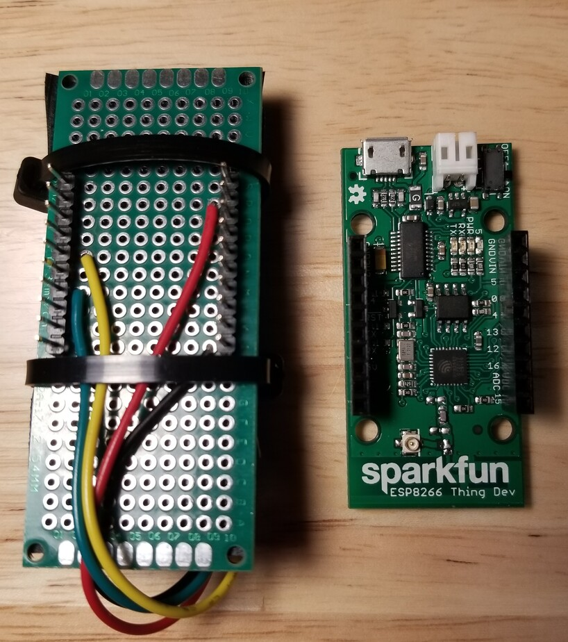
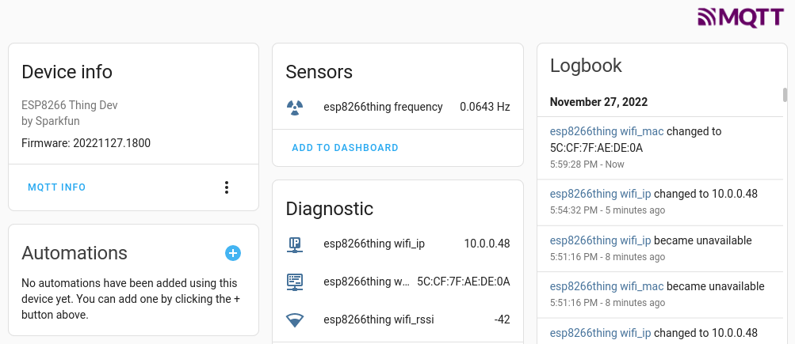
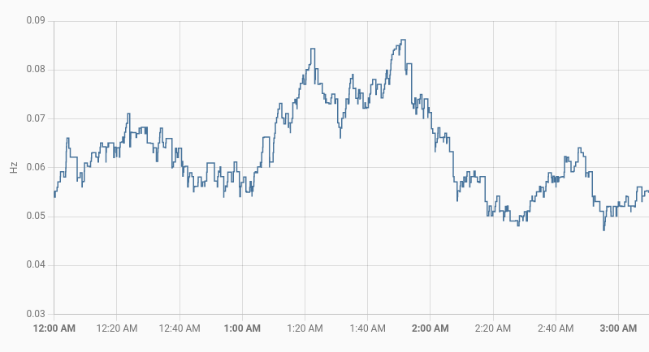
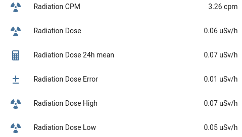
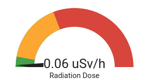
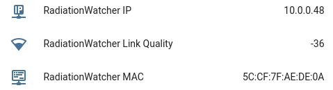

# RadiationWatcher #

Overview | Details
---|---
Language: | C++ 
IDE: | [PlatformIO](https://platformio.org/) (VS Code + PlatformIO extension)
Microcontroller: |  [Sparkfun ESP8266 Thing Dev](https://www.sparkfun.com/products/13711)
Radiation Sensor: | [Type 5 Pocket Geiger Radiation Sensor]( https://www.sparkfun.com/products/14209) from [Radiation Watch](http://www.radiation-watch.org/)




The radiation detector interface uses a 3.5mm audio jack as a connector as well as pads on the board. I wanted to keep the option of putting it back into the white plastic case it comes to use it with a phone. So I soldered a 90 degree pin header on (so that it could remain on even if placed back in its case).
Conveniently, the radiation detector accepts any voltage between 3V and 9V. As the Esp8266 runs at 3.3V I simply used that. 



I created a daughtercard for the ESP8266 Thing upon which I could mount the radiation detector. There are no mounting holes, hence the dodgy zip ties to hold to two together. I placed the two brass plates that come with the radiation detector on either side of the board. These plates block out any alpha and beta particles so our measurements will strictly be gamma only. The sensor area with the plates is wrapped in electrical tape.



On the bottom view you can see how pins 4 (yellow) and 12 (green) map to noise (NS) and signal (SIG) respectively.



## MQTT ##

When the device starts, it establishes a wifi connection (rename [sample_env.h](src/sample-env.h) to env.h and edit for your own environment) and sends a few Home Assistant auto-discovery messages. It announces itself with an "online" message on its availability topic. 
Then it settles into sending sensor updates. The updates happen when the sensor is triggered. In my experience there can be anywhere from 1 second to 90 seconds between triggers, though the median is probably in the lower third range. 
Each sensor update sends the following message:
```
homeassistant/sensor/esp8266thing/state
{
  "frequency": 0.0461,
  "frequency_details": {
    "dose": 0.04,
    "dose_err": 0.01,
    "cpm": 2.3
  }
}
``` 
You can change the device id ("esp8266thing") by updating [DEVICE_ID in radthing.h](include/radthing.h).

The "cpm" measurement is clicks-per-minute, like a traditional geiger tube counter. It counts the frequency of gamma particle impacts and is translated into equivalent dose in micro sieverts per hour. 
Home Assistant has no radiation measurement support, but does support frequency. The CPM is converted to cycles per second (hertz) and announced as a frequency update. The CPM and dose values are also included in the payload. 

Every 5 minutes the device will send diagnostic information and refresh its "online" availability status.
```
homeassistant/sensor/esp8266thing/diagnostics
{
  "wifi_rssi": -36,
  "wifi_ip": "10.0.0.48",
  "wifi_mac": "5C:CF:7F:AE:DE:0A"
}
```

## Home Assistant Integration ##

The sensor state (frequency) and diagnostics all have MQTT auto-discovery messages that are sent as the device is starting up. These are retained messages, so will be available to Home Assistant in the event of an HA restart. 





The discovery message for frequency:
```
homeassistant/sensor/esp8266thing/frequency/config
{
  "device_class": "frequency",
  "unit_of_measurement": "Hz",
  "state_class": "measurement",
  "availability_topic": "homeassistant/sensor/esp8266thing/availability",
  "unique_id": "esp8266thing_frequency",
  "device": {
    "name": "RadiationWatcher",
    "identifiers": "5C:CF:7F:AE:DE:0A",
    "mf": "Sparkfun",
    "mdl": "ESP8266 Thing Dev",
    "sw": "20221127.1800"
  },
  "name": "esp8266thing frequency",
  "icon": "mdi:radioactive",
  "state_topic": "homeassistant/sensor/esp8266thing/state",
  "value_template": "{{ value_json.frequency }}",
  "json_attributes_topic": "homeassistant/sensor/esp8266thing/state",
  "json_attributes_template": "{{ value_json.frequency_details | tojson }}"
}
```

The discovery messages for diagnostics, specifically measurable (but unitless) RSSI:
```
homeassistant/sensor/esp8266thing/wifi_rssi/config
{
  "state_class": "measurement",
  "entity_category": "diagnostic",
  "availability_topic": "homeassistant/sensor/esp8266thing/availability",
  "unique_id": "esp8266thing_wifi_rssi",
  "device": {
    "name": "RadiationWatcher",
    "ids": "5C:CF:7F:AE:DE:0A"
  },
  "name": "esp8266thing wifi_rssi",
  "icon": "mdi:wifi-strength-2",
  "state_topic": "homeassistant/sensor/esp8266thing/diagnostics",
  "value_template": "{{ value_json.wifi_rssi }}"
}
```
The other diagnostics (MAC, IP) are similar, but obviously not measurable so lack the state_class.

Manual updates that you will want to add to your Home Assistant configuration.yaml:
(these tease out the sub-attributes of frequency)



```
template:
  - sensor:
      - name: "Radiation CPM"  # Radiation Detection Event (per minute)
        unique_id: radiation_cpm
        device_class: frequency
        state_class: measurement
        unit_of_measurement: "cpm"
        icon: mdi:radioactive
        state: >
          {{ state_attr("sensor.esp8266thing_frequency", "cpm") | float(default=0) }}

      - name: "Radiation Dose"
        unique_id: radiation_dose
        state_class: measurement
        unit_of_measurement: "uSv/h"
        icon: mdi:radioactive
        state: >
          {{ state_attr("sensor.esp8266thing_frequency", "dose") | float(default=0) }}

      - name: "Radiation Dose Error"
        unique_id: radiation_dose_err
        state_class: measurement
        unit_of_measurement: "uSv/h"
        icon: mdi:plus-minus
        state: >
          {{ state_attr("sensor.esp8266thing_frequency", "dose_err") | float(default=0) }}

      - name: "Radiation Dose High"
        unique_id: radiation_dose_hi
        state_class: measurement
        unit_of_measurement: "uSv/h"
        icon: mdi:radioactive
        state: >
          {{ (state_attr("sensor.esp8266thing_frequency", "dose")|float(default=0)+state_attr("sensor.esp8266thing_frequency", "dose_err")|float(default=0))|round(2, "common")}}

      - name: "Radiation Dose Low"
        unique_id: radiation_dose_lo
        state_class: measurement
        unit_of_measurement: "uSv/h"
        icon: mdi:radioactive
        state: >
          {{ (state_attr("sensor.esp8266thing_frequency", "dose")|float(default=0)-state_attr("sensor.esp8266thing_frequency", "dose_err")|float(default=0))|round(2, "common")}}

# Get the daily high radiation dose average
sensor:
  - name: "Radiation Dose 24h mean"
    platform: statistics
    entity_id: sensor.radiation_dose_high
    state_characteristic: mean
    max_age:
      hours: 24

# Create a safetly binary trigger based on daily radiation high dose equivalent exceeding 3 mSv/yr
binary_sensor:
  - name: Radiation exceeds Normal per 24h # over normal 3 mSv/yr
    platform: threshold
    device_class: safety
    entity_id: sensor.radiation_dose_24h_mean
    upper: 0.342

```

Radiation workers: 
limit of [50 mSv in a single year and 100 mSv over 5 years](https://laws-lois.justice.gc.ca/eng/regulations/SOR-2000-203/FullText.html) (a 20 mSv per year average) 

Recommended hourly limit: 

Annual Exposure | conversion | Hourly Exposure
--|--|--
3mSv/yr | 3 * 1000 = 3000 uSv/yr  / 365 = 8.22 uSv/day / 24 | 0.342 uSv/hr 
20 mSv/yr | 20 * 1000 = 20,000 uSv/yr / 365 = 55 uSv/day / 24 | 2.3 uSv/hr 
50 mSv/yr | 50 * 1000 = 50,000 uSv/yr / 365 = 137 uSv/day / 24 | 5.7 uSv/hr 

Exposure | Level 
--|--
0-3 mSv/yr | normal 
4-20 mSv/yr | moderate 
20+ mSv/yr | high 

 
A UI gauge can be added with the following ranges:

A max of 6 based on no more than 5.7 uSv/hr for radiation workers

A green area up to 0.342 uSv/hr for normal background radiation, a yellow area up to 2.3 uSv/hr based on normal exposure being up to 20 mSv/yr and a red area beyond that up to 50 mSv/yr for radiation workers.

```
type: gauge
entity: sensor.radiation_dose_high
name: Radiation Dose
unit: uSv/h
min: 0
max: 6
needle: true
severity:
  green: 0
  yellow: 0.342
  red: 2.3
```


### Sensor Diagnostics in Home Assistant ###



```
mqtt:
   sensor:
    - name: "RadiationWatcher Link Quality"
      object_id: "esp8266thing_link"      
      state_topic: "homeassistant/sensor/esp8266thing/diagnostics"                    
      value_template: "{{ value_json.wifi_rssi | int() }}"
      entity_category: "diagnostic"
      state_class: "measurement"
      icon: "mdi:wifi-strength-2"   

    - name: "RadiationWatcher IP"
      object_id: "esp8266thing_ip"
      state_topic: "homeassistant/sensor/esp8266thing/diagnostics"      
      value_template: "{{ value_json.wifi_ip }}"
      entity_category: "diagnostic"      
      icon: "mdi:ip-network"
      availability:
        - topic: "homeassistant/sensor/esp8266thing/availability"
          payload_available: "online"
          payload_not_available: "offline"

    - name: "RadiationWatcher MAC"
      object_id: "esp8266thing_mac"
      state_topic: "homeassistant/sensor/esp8266thing/diagnostics"      
      value_template: "{{ value_json.wifi_mac }}"
      entity_category: "diagnostic"      
      icon: "mdi:network-pos"
      availability:
        - topic: "homeassistant/sensor/esp8266thing/availability"
          payload_available: "online"
          payload_not_available: "offline"             
```

The wireless link quality is measured in unitless RSSI.
Range is from -100 to -30
RSSI Range | Quality | Color
--|--|--
-100..-70 | poor | red
-70..-50 | moderate | yellow
-50..-30 | good | green

```
type: gauge
entity: sensor.esp8266thing_link
severity:
  green: -50
  yellow: -70
  red: -100
min: -100
max: -30
```

